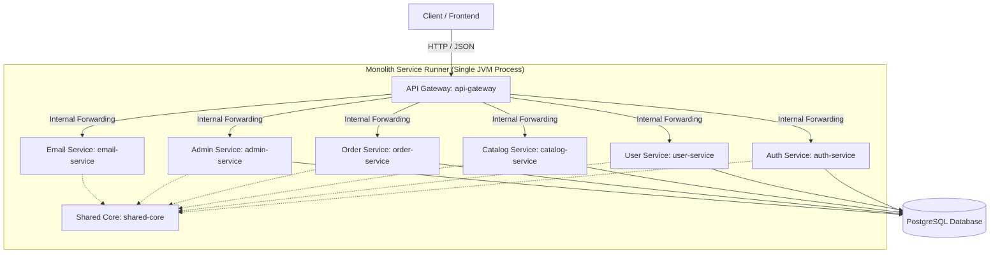
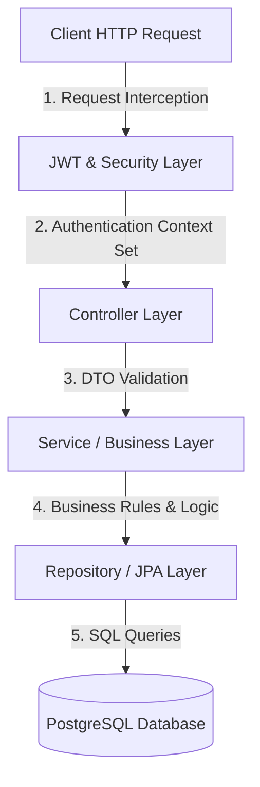

# Project Architecture: DurgaShakti Foils

This document outlines the architectural design of the DurgaShakti Foils backend, including the hybrid microservice structure, the internal layered architecture of each service, the JWT/Security flow, database patterns, and the deployment compromises implemented for cost optimization.

---

## 1. High-Level Architecture Overview

The backend uses a **Microservice Architecture** that has been consolidated into a **Hybrid Monolithic Deployment** to remain completely compatible with low-cost/free hosting environments (specifically the Render free tier).



---

## 2. Maven Module Hierarchy & Dependency Management

The project is structured as a Maven multi-module project. Version control and dependencies are centralized in the parent `pom.xml` to avoid conflicts and simplify updates:

```
backend/ (Parent POM)
 ├── shared-core/          (Common entities, JWT utilities, and exceptions)
 ├── api-gateway/          (Routing and request interception)
 ├── auth-service/         (Authentication & JWT generation)
 ├── user-service/         (User profile & address management)
 ├── catalog-service/      (Product, categories, and inventory)
 ├── order-service/        (Cart, checkout, payments, and invoices)
 ├── admin-service/        (Admin controls, imports/exports, and ticketing)
 ├── email-service/        (Notification dispatches)
 └── monolith-service/     (Aggregator module & monolithic runtime packaging)
```

### Module Descriptions
| Module / Directory Name | Description |
| :--- | :--- |
| **[`shared-core`](file:///c:/Users/megha.choda/.gemini/antigravity/scratch/durgashakti-foils/backend/shared-core)** | The shared library containing core domain entities, data transfer objects (DTOs), exception handlers, security configurations, and JWT utilities used by all services. |
| **[`api-gateway`](file:///c:/Users/megha.choda/.gemini/antigravity/scratch/durgashakti-foils/backend/api-gateway)** | A Spring Cloud Gateway module that coordinates API routing. It intercepts external incoming client requests under `/api/**` and directs them to the respective service routes. |
| **[`auth-service`](file:///c:/Users/megha.choda/.gemini/antigravity/scratch/durgashakti-foils/backend/auth-service)** | Handles user registration, authentication, JWT token generation, password resets, and role assignments. |
| **[`user-service`](file:///c:/Users/megha.choda/.gemini/antigravity/scratch/durgashakti-foils/backend/user-service)** | Manages customer profiles, shipping/billing addresses, and customer-specific wishlists. |
| **[`catalog-service`](file:///c:/Users/megha.choda/.gemini/antigravity/scratch/durgashakti-foils/backend/catalog-service)** | Responsible for product catalog metadata, category management, pricing, inventory tracking, and reviews. |
| **[`order-service`](file:///c:/Users/megha.choda/.gemini/antigravity/scratch/durgashakti-foils/backend/order-service)** | Handles shopping cart state, coupon application logic, order processing, Razorpay payment verification, and PDF invoice generation. |
| **[`admin-service`](file:///c:/Users/megha.choda/.gemini/antigravity/scratch/durgashakti-foils/backend/admin-service)** | Internal utility service for admin functions, including dashboard analytics, customer activity monitoring, support ticketing, and bulk Excel imports/exports. |
| **[`email-service`](file:///c:/Users/megha.choda/.gemini/antigravity/scratch/durgashakti-foils/backend/email-service)** | Asynchronous module that dispatches email notifications (registration verification, invoice confirmation, reset passwords). |
| **[`monolith-service`](file:///c:/Users/megha.choda/.gemini/antigravity/scratch/durgashakti-foils/backend/monolith-service)** | The **Combined Monolithic Runner** that bootstraps all of the services above concurrently in a single JVM instance. |

---

## 3. Detailed Layered Architecture (Inside Each Microservice)

Every microservice implements a strict, multi-tiered layered structure to ensure code maintainability, clean data mappings, and secure operations.



### 1. JWT & Security Layer
* **Spring Security Config:** Intercepts incoming HTTP requests. Paths that are public (e.g., product catalog lookup, registration) are permitted directly, while protected paths require authentication.
* **`JwtAuthenticationFilter`:** Extracts the JWT bearer token from the HTTP `Authorization` header.
* **`JwtUtil`:** Validates the token's signature, expiration, and extracts claims (such as username, user ID, and roles/authorities).
* **Security Context:** If validation succeeds, builds a `UsernamePasswordAuthenticationToken` using the user's `UserPrincipal` and injects it into the `SecurityContextHolder`.

### 2. Controller Layer (API / Entry Points)
* Exposes RESTful API endpoints using `@RestController`.
* Handles HTTP mappings (`@GetMapping`, `@PostMapping`, etc.).
* Receives user requests using dedicated DTOs (Data Transfer Objects) and applies validation constraints (using annotations like `@Valid`, `@NotNull`, `@Size`).
* Returns responses encapsulated inside Spring's `ResponseEntity<T>`.

### 3. Service / Business Logic Layer
* Marked with `@Service`. 
* Implements the core business domain logic (e.g., calculating discount coupons, validating order conditions, processing Razorpay integration).
* Performs transactional management using Spring's `@Transactional`.
* Coordinates calls across different Spring beans and repositories.

### 4. Repository / JPA Layer
* Consists of JPA Interfaces extending `JpaRepository<Entity, ID>`.
* Interacts directly with database objects using Object-Relational Mapping (ORM) managed by Hibernate.
* Performs write/read database operations and custom native/JPQL queries.

### 5. Shared Core / Common Libraries
* Shared utilities, custom exception structures (like `ApiException`), global exception translators (`GlobalExceptionHandler`), and data schemas (like `User`, `Order`, `Product`) reside in the [`shared-core`](file:///c:/Users/megha.choda/.gemini/antigravity/scratch/durgashakti-foils/backend/shared-core) module. This ensures all layers across all modules share a unified model.

---

## 4. Shared Database & Cross-Module Queries

In a fully decoupled microservice architecture, each service owns its database. In this hybrid microservices model:
1. **Logical Separation:** Services only access the tables related to their business functions. For example, `catalog-service` manages `Product` and `Category` entities, while `order-service` manages `Order` and `Cart` entities.
2. **Shared Database Instance:** To optimize costs and resources, all tables reside in a single PostgreSQL database schema.
3. **Cross-Module JPA Entities:** To execute queries across domain boundaries without network calls, modules import the entity definitions from `shared-core` and construct local, service-specific repositories. For example, `order-service` includes an [`OrderUserRepository`](file:///c:/Users/megha.choda/.gemini/antigravity/scratch/durgashakti-foils/backend/order-service/src/main/java/com/durgashakti/order/repository/OrderUserRepository.java) that queries the `User` entity directly, avoiding the need for an external REST request to `user-service`.

---

## 5. Cross-Cutting System Concerns

### Asynchronous Operations & Email Scheduling
* **Non-blocking Dispatches:** Time-consuming operations such as triggering transactional emails or verification links are handled asynchronously to prevent blocking client request threads.
* **Cron Schedulers:** Tasks like expiring unpaid orders or cleanup schedules are processed using Spring's `@Scheduled` annotation (configured inside the runner configuration).

### Global Exception Translator
* Errors generated in any layer are caught by Spring's `@ControllerAdvice` via `GlobalExceptionHandler` inside the `shared-core` module.
* This guarantees that clients receive a standardized, professional API error response format:
  ```json
  {
    "status": 400,
    "error": "Bad Request",
    "message": "Detailed error message here",
    "timestamp": "2026-06-25T13:20:00Z"
  }
  ```

---

## 6. Why `monolith-service` exists (Render Free Tier Cost-Cutting)

Although developing in a microservice architectural pattern is highly clean and scalable, running **9 separate JVM processes** (8 microservices + 1 gateway) is highly inefficient and expensive for staging, hobby, or small-scale production deployments. 

Specifically, **Render's Free Tier** poses severe constraints:
1. **Sleep Mode (Cold Starts):** If a service goes unused for 15 minutes, Render shuts down the active container. A cold start for a single Spring Boot service takes **30 to 50 seconds**. If a client request chains across multiple separate services, they wake up sequentially, causing immediate HTTP request timeouts.
2. **RAM Allocation Limit (512 MB):** A single Spring Boot container typically requires ~250MB–350MB of RAM. Running 9 separate servers would require **2.5 GB to 3 GB** of total memory, exceeding free tier limits and causing constant Out Of Memory (OOM) app crashes.
3. **Monthly Build Time Cap (500 minutes):** Building and packaging 9 separate Docker containers or Web Services on every code push easily consumes the monthly allocation within a few deployments.

### The Hybrid Solution
To solve these deployment limits, `monolith-service` acts as a **monolithic wrapper** around the modular codebase:
* It includes all the other microservice modules as Maven dependencies in its [pom.xml](file:///c:/Users/megha.choda/.gemini/antigravity/scratch/durgashakti-foils/backend/monolith-service/pom.xml).
* The [CombinedApplication.java](file:///c:/Users/megha.choda/.gemini/antigravity/scratch/durgashakti-foils/backend/monolith-service/src/main/java/com/durgashakti/combined/CombinedApplication.java) launches all components under a single Spring context.
* This allows the entire backend ecosystem to run under **one single port (8080)** on **one single Render Web Service**, sharing the exact same RAM overhead and completely avoiding nested cold-start delays.

This ensures you get the clean software design patterns of microservices during local development, alongside the cost efficiency and simplicity of a monolith in production.
