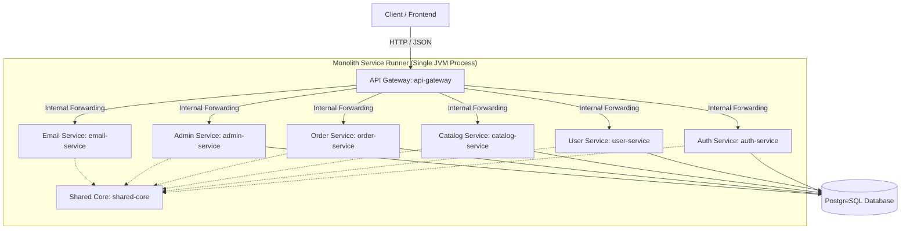

# Project Architecture: DurgaShakti Foils

This document outlines the architectural design of the DurgaShakti Foils backend, including the hybrid microservice structure and the deployment compromises implemented for cost optimization.

---

## 1. High-Level Architecture Overview

The backend uses a **Microservice Architecture** that has been consolidated into a **Hybrid Monolithic Deployment** to remain completely compatible with low-cost/free hosting environments (specifically the Render free tier).

---

## 2. Key Modules & Services

The codebase is split into independent Maven modules to maintain high modularity, strict separation of concerns, and clean boundaries:

| Module / Directory Name | Description |
| :--- | :--- |
| **[`shared-core`](file:///c:/Users/megha.choda/.gemini/antigravity/scratch/durgashakti-foils/backend/shared-core)** | The shared library containing core domain entities, data transfer objects (DTOs), exception handlers, security configurations, and JWT utilities used by all services. |
| **[`api-gateway`](file:///c:/Users/megha.choda/.gemini/antigravity/scratch/durgashakti-foils/backend/api-gateway)** | A Spring Cloud Gateway module that coordinates API routing. It intercepts external incoming client requests under `/api/**` and directs them to the respective service routes. |
| **[`auth-service`](file:///c:/Users/megha.choda/.gemini/antigravity/scratch/durgashakti-foils/backend/auth-service)** | Handles user registration, authentication, JWT token generation, password resets, and role assignments. |
| **[`user-service`](file:///c:/Users/megha.choda/.gemini/antigravity/scratch/durgashakti-foils/backend/user-service)** | Manages customer profiles, shipping/billing addresses, and customer-specific wishlists. |
| **[`catalog-service`](file:///c:/Users/megha.choda/.gemini/antigravity/scratch/durgashakti-foils/backend/catalog-service)** | Responsible for product catalog metadata, category management, pricing, inventory tracking, and reviews. |
| **[`order-service`](file:///c:/Users/megha.choda/.gemini/antigravity/scratch/durgashakti-foils/backend/order-service)** | Handles shopping cart state, coupon application logic, order processing, Razorpay payment verification, and PDF invoice generation. |
| **[`admin-service`](file:///c:/Users/megha.choda/.gemini/antigravity/scratch/durgashakti-foils/backend/admin-service)** | Internal utility service for admin functions, including dashboard analytics, customer activity monitoring, support ticketing, and bulk Excel imports/exports. |
| **[`email-service`](file:///c:/Users/megha.choda/.gemini/antigravity/scratch/durgashakti-foils/backend/email-service)** | Asynchronous module that dispatches email notifications (registration verification, invoice confirmation, reset passwords). |
| **[`monolith-service`](file:///c:/Users/megha.choda/.gemini/antigravity/scratch/durgashakti-foils/backend/monolith-service)** | The **Combined Monolithic Runner** that bootstraps all of the services above concurrently in a single JVM instance. |

---

## 3. Why `monolith-service` exists (Render Free Tier Cost-Cutting)

Although developing in a microservice architectural pattern is highly clean and scalable, running **9 separate JVM processes** (8 microservices + 1 gateway) is highly inefficient and expensive for staging, hobby, or small-scale production deployments. 

Specifically, **Render's Free Tier** poses severe constraints:
1. **Sleep Mode (Cold Starts):** If a service goes unused for 15 minutes, Render shuts down the active container. A cold start for a single Spring Boot service takes **30 to 50 seconds**. If a client request chains across multiple separate services, they wake up sequentially, causing immediate HTTP request timeouts.
2. **RAM Allocation Limit (512 MB):** A single Spring Boot container typically requires ~250MB–350MB of RAM. Running 9 separate servers would require **2.5 GB to 3 GB** of total memory, exceeding free tier limits and causing constant Out Of Memory (OOM) app crashes.
3. **Monthly Build Time Cap (500 minutes):** Building and packaging 9 separate Docker containers or Web Services on every code push easily consumes the monthly allocation within a few deployments.

### The Hybrid Solution
To solve these deployment limits, `monolith-service` acts as a **monolithic wrapper** around the modular codebase:
* It includes all the other microservice modules as Maven dependencies in its [pom.xml](file:///c:/Users/megha.choda/.gemini/antigravity/scratch/durgashakti-foils/backend/monolith-service/pom.xml).
* The [CombinedApplication.java](file:///c:/Users/megha.choda/.gemini/antigravity/scratch/durgashakti-foils/backend/monolith-service/src/main/java/com/durgashakti/combined/CombinedApplication.java) launches all components under a single Spring context.
* This allows the entire backend ecosystem to run under **one single port (8080)** on **one single Render Web Service**, sharing the exact same RAM overhead and completely avoiding nested cold-start delays.

This ensures you get the clean software design patterns of microservices during local development, alongside the cost efficiency and simplicity of a monolith in production.
